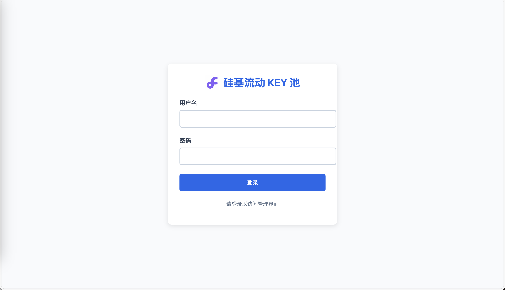
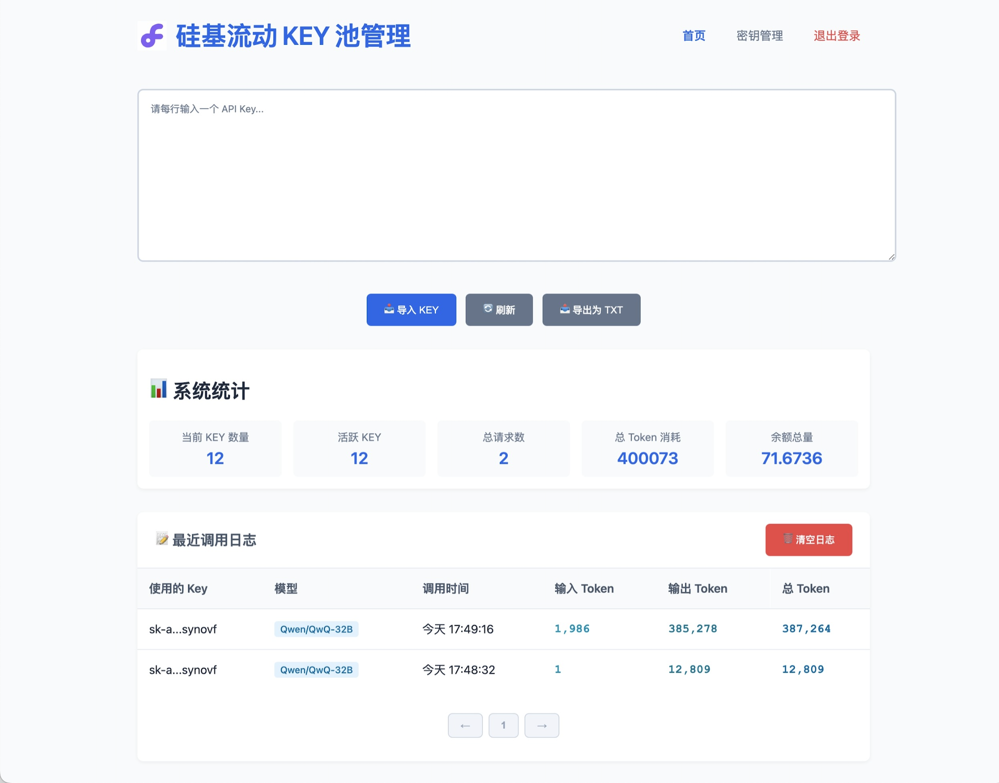
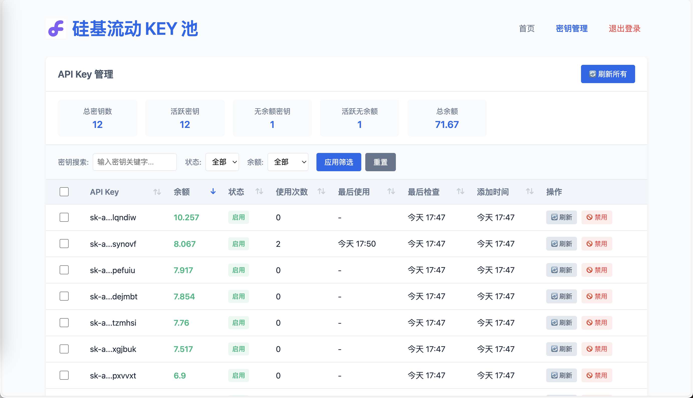

# Silicon Key Pool - 硅基 KEY 池

Silicon Key Pool 是一个基于 Cloudflare Workers 的 API 密钥管理系统，专为管理和分发 SiliconFlow API 密钥而设计。它提供了一个简单而强大的界面，用于管理多个 API 密钥，监控使用情况，并优化资源分配。

## 功能特点

- **API 密钥池管理**：集中管理多个 API 密钥，自动选择可用密钥
- **密钥状态监控**：实时监控密钥余额和有效性
- **批量操作**：支持批量刷新、启用、禁用和删除密钥
- **使用统计**：查看密钥使用情况和请求日志
- **用户友好界面**：直观的管理界面，支持筛选、排序和分页
- **安全认证**：管理员登录系统，保护敏感操作
- **高性能架构**：基于 Cloudflare Workers 和 D1 数据库，快速且可靠


## 功能指南

### 管理界面

部署后，访问以下页面：

- **首页**：`/` - 未登录时显示登录页面，已登录时自动跳转到管理页面

- **管理页面**：`/admin` - 查看系统统计信息和日志

- **密钥管理**：`/keys` - 管理 API 密钥


### 密钥管理功能

- **导入密钥**：批量导入 API 密钥
- **刷新密钥**：更新密钥状态和余额信息
- **启用/禁用密钥**：控制密钥是否可用
- **筛选和排序**：根据不同条件筛选和排序密钥
- **删除无余额密钥**：清理无余额的密钥

### API 端点

- **获取 API 密钥**：`/api/key` - 获取一个可用的 API 密钥
- **OpenAI API 代理**：`/v1/*` - 代理 OpenAI 兼容的 API 请求

## 系统架构

Silicon Key Pool 基于以下技术构建：

- **Cloudflare Workers**：提供无服务器运行环境
- **Cloudflare D1**：SQLite 兼容的边缘数据库
- **KV Asset Handler**：处理静态资源
- **Modern JavaScript**：使用 ES 模块和现代 JavaScript 特性

## 本地调试
### D1 数据库
```bash
wrangler d1 create silicon_key_pool --local
wrangler d1 execute silicon_key_pool --file=./migrations/schema.sql --local
```

### KV 命名空间
```bash
# 创建本地 KV 命名空间
wrangler kv:namespace create STATIC_CONTENT --local
# 上传所有静态页面到本地 KV 存储
./deploy-static local
# 查看本地 KV 命名空间资源
wrangler kv:key list --binding=STATIC_CONTENT --local
```

## 本地运行
```bash
wrangler dev --local
```

## 部署到 Cloudflare

部署到 Cloudflare 请参考 [部署文档](./docs/Deploy.MD)

### 常见问题

1. **无法登录管理界面**
   - 确认 `ADMIN_USERNAME` 和 `ADMIN_PASSWORD` 设置正确
   - 检查浏览器 Cookie 是否启用

2. **密钥刷新失败**
   - 确认 `BASE_URL` 设置正确
   - 检查 API 密钥格式是否有效

3. **数据库错误**
   - 确保已正确创建数据库表
   - 检查 D1 数据库绑定配置


## 安全最佳实践

- 使用强密码保护管理界面
- 定期轮换 API 密钥
- 限制管理界面的访问 IP
- 启用 Cloudflare 的安全功能，如 WAF 和 Bot 管理

## 贡献指南

欢迎贡献代码、报告问题或提出改进建议。请遵循以下步骤：

1. Fork 仓库
2. 创建功能分支 (`git checkout -b feature/amazing-feature`)
3. 提交更改 (`git commit -m 'Add some amazing feature'`)
4. 推送到分支 (`git push origin feature/amazing-feature`)
5. 创建 Pull Request

## 许可证

[MIT](LICENSE)

## 致谢

- [Cloudflare Workers](https://workers.cloudflare.com/)
- [Cloudflare D1](https://developers.cloudflare.com/d1/)
- [SiliconFlow API](https://siliconflow.cn/)
